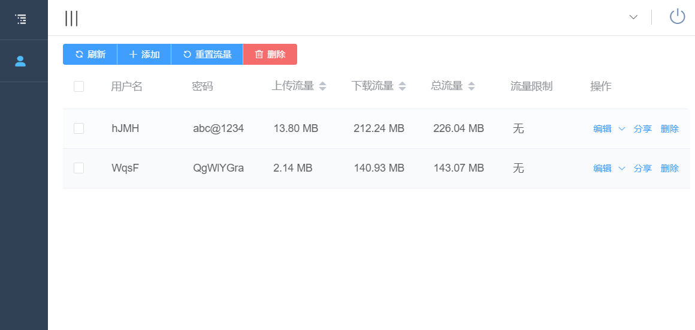

# trojan
  
 
 
[](https://goreportcard.com/report/github.com/Jrohy/trojan)
[](http://hits.dwyl.com/Jrohy/trojan)
[](https://img.shields.io/github/downloads/Jrohy/sshcopy/total.svg)


trojan多用户管理部署程序

## 功能
- 在线web页面和命令行两种方式管理trojan多用户
- 启动 / 停止 / 重启 trojan 服务端
- 支持流量统计和流量限制
- 命令行模式管理, 支持命令补全
- 集成acme.sh证书申请
- 生成客户端配置文件
- 支持trojan://分享链接和二维码分享(二维码仅限web页面)

## 安装方式
*trojan使用请提前准备好服务器可用的域名*  

###  a. 一键脚本安装
```
#安装/更新
source <(curl -sL https://git.io/trojan-install)

#卸载
source <(curl -sL https://git.io/trojan-install) --remove

```
安装完后输入'trojan'可进入管理程序   
浏览器访问 http://域名 可在线web页面管理trojan用户  
前端页面源码地址: [trojan-web](https://github.com/Jrohy/trojan-web)

web界面:


### b. docker运行
1. 安装mysql
```
docker run --name trojan-mysql --restart=always -p 3306:3306 -v /home/mysql:/var/lib/mysql -e MYSQL_ROOT_PASSWORD=trojan -e MYSQL_ROOT_HOST=% -e MYSQL_DATABASE=trojan -d mysql/mysql-server:5.7
```
端口和root密码以及持久化目录都可以改成其他的

2. 安装trojan
```
docker run -it -d --name trojan --net=host --restart=always --privileged jrohy/trojan init
```
运行完后进入容器 `docker exec -it trojan bash`, 然后输入'trojan'即可进行初始化安装   

启动web服务: `systemctl start trojan-web`   

设置自启动: `systemctl enable trojan-web`

## 命令行
```
Usage:
  trojan [flags]
  trojan [command]

Available Commands:
  add         添加用户
  completion  自动命令补全(支持bash和zsh)
  del         删除用户
  help        Help about any command
  info        用户信息列表
  restart     重启trojan
  start       启动trojan
  status      查看trojan状态
  stop        停止trojan
  tls         证书安装
  update      更新trojan
  version     显示版本号
  web         以web方式启动

Flags:
  -h, --help   help for trojan
```

## 注意
安装完trojan后强烈建议开启BBR等加速: [Linux-NetSpeed](https://github.com/chiakge/Linux-NetSpeed)  
推荐的trojan客户端: [Trojan-Qt5](https://github.com/TheWanderingCoel/Trojan-Qt5)
